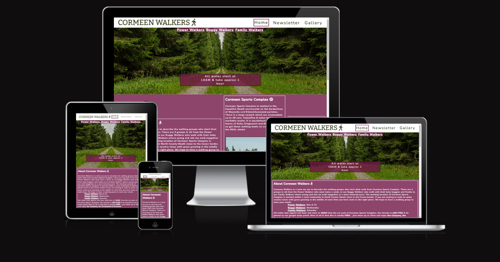
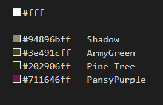
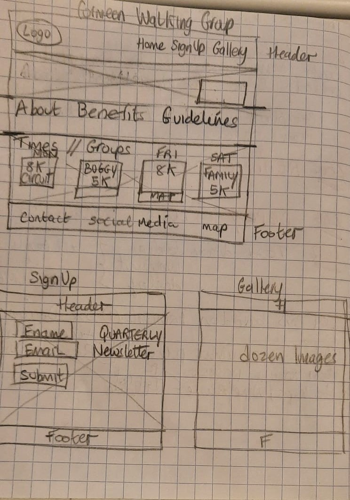

unfortunately my html and css are not passing validators
# Cormeen Walkers

# Overview
Cormeen Walkers is a website about walking groups that meet for their walk at Cormeen Sports Complex in rural Co Meath.  There are 3 diverse walking groups that meet weekly although one group, the Power Walkers meet twice a week.  Each group has their own pace and distance but all walks are completed in an hour. The website gives information about when each group meet, where they meet & how far they walk. Each quarter there is a longer 3 hour walk in the nearby mountain and details about this excursion can be received by signing up for the newsletter.  There is a gallery with photos taken by Cormeen Walkers. 

## Goal
I created this website as I was continually contacted for information about these walking groups, when and where they meetup etc & I want to be able to direct them to the website which will give them all of the information they seek. I specifically do not want to include a contact phone number as I am trying to avoid receiving calls. 

## Target Audience
This website is a landing page for 
- Anyone living in the locality looking for information about walking groups.
- Those who know vaguely of the groups' existence but need specific information about meetup day/time & distance covered.
- Those who have lapsed in attending weekly walks and want to start walking again.
- New people who have moved into the area.

The GitHub link to the live site is https://siobhain.github.io/cormeen-walkers/

## CONTENTS

* [User Experience](#user-experience-ux)
  * [User Stories](#user-stories)

* [Design](#design)
  * [Colour Scheme](#colour-scheme)
  * [Typography](#typography)
  * [Imagery](#imagery)
  * [Wireframes](#wireframes)

* [Features](#features)
  * [General Features on Each Page](#general-features-on-each-page)
  * [Future Implementations](#future-implementations)
  * [Accessibility](#accessibility)

* [Technologies Used](#technologies-used)
  * [Languages Used](#languages-used)
  * [Frameworks, Libraries & Programs Used](#frameworks-libraries--programs-used)

* [Deployment & Local Development](#deployment--local-development)
  * [Deployment](#deployment)
  * [Local Development](#local-development)
    * [How to Fork](#how-to-fork)
    * [How to Clone](#how-to-clone)

* [Testing](#testing)

* [Credits](#credits)
  * [Code Used](#code-used)
  * [Content](#content)
  * [Media](#media)
  * [Acknowledgments](#acknowledgments)

---

## User Experience (UX)

### User Stories

#### Client Goals

- To minimise amount of time explaining when/where the walking groups meet, the pace, the routes taken & distance covered.
- Site to be responsive -  viewable on all device sizes & all commonly used  browsers
- Users to receive a newsletter by providing a name & email address
- Users can easily find eircode of the meeting place and/or pin meeting place on google maps.
- Purposely do NOT include a contact phone number on this website as a main goal is to reduce number of phone calls.
- Users can view gallery with photos of whats to be seen on the walks & invited to let walk leader know if they have photos to add.

Users may arrive at this page via web search or direct link

##### First time user can be
- Interesting in finding out more about Cormeen Walkers.
- Looking for general information about the walking groups and where they meet.
- Looking for meet up times & location of a particular group.
- Looking for duration & distance of each groups' walks.

##### Returning Visitors
 - looking for day and time of a particular walking group
 - looking for directions or eircode for the meetup location
 - interested in singing up for newsletter

## Design

### Colour Scheme

The colors chosen reflect the countryside lanes and the building at the meetup location. It was very difficult to come up with a suitable palette and I'm still not entirely happy with the current palette.

Colors used are White for most of the text &

### Typography

The fonts used for this website are Bitter & Nunito, Bitter is a serif type font & used for logo "Cormeen Walkers" in the header. Nunito is a san serif type font and used for all other text. Both fonts are imported from [Google Fonts](https://fonts.google.com/).  

With these font choices I have made the conscious decision to mix a serif with a san serif. The serif Bitter is used only in the header of the web page & although it is a traditional style it has a modern twist. The font is specifically designed for comfortably reading on any computer or device and is refeered to as a 'contemporary' serif typeface for text.  I did want to use a traditional type font for the logo but not one designed over 100 years ago and so Bitter became my choice. For the main text I wanted a clean looking text without extras so as not to distract from the information presented, but one that also blended well with the Bitter logo. Hence I chose Nunito which is a well balanced san serif type font & I think they work well together in this case.

### Imagery

#### Photos

1. The hero image is a country lane typical of the locality in which the walks take place, it is used to attract users that are interested in walking in quiet rural country lanes.
2. The reason for the building image shown in "About Cormeen Sports Complex" is two fold, 1st for people who are familiar with the building it is used to jog their memory as to where the meetup place is & 2nd for new walkers and/or new people to the area it is to help them realise that they have arrived at the location & not drive past it.
3. There are 2 further images at the end of home page in whats referred to as the 'benefits-section' in html. The 1st image is taken in Jan 2022 outside Cormeen Sports Complex before the Family Walkers start, it is used to show users a typical walking groups from Cormeen.  The 2nd, a close up of walking in leaves, is used to encourage the user to come out walking, It is beside the 'Benefits to Walkers' text so meant as a motivitational picture for the user.
4. The Signup page (Newsletter in navigation menu) has a background image from Loughan Lae our local mountain. This is a teaser for users as the signup panel covers most of this picture, they are prompted to signup so that the panel goes away and they get to see the beautiful Loughan Lae.
5. In the gallery page there are 12 photos taken by Cormeen Walkers, at time of writing some of these images are repeated on this page & i will endeavor to have 12 unique images by submission time but please forgive if this does not occur.

#### Icons 
- The are 9 icons used in this website and they are are freely available from [Font Awesome](https://fontawesome.com/), The 9 icons are outlined [here](docs/fa-icon.PNG). Each icon element is given aria-label for accessibility purposes.

### Wireframes

The original wireframe drawn up before starting any html is as follows

The plan is to create a site with 3 pages,  Home, Signup (now Newsletter) & Gallery. 

Header & Footer common to all 3 pages & apart from these common panels the following is the layout of the 3 pages :

- Home Page : 4 sections : Hero,  About, Groups, Benefits
- Signup Page : 1 section :  Form (firstname, email form & submit button)
- Gallery Page : 4 sections (Gallery & Photo) x2

Each page can be reached from the menu in the header. The currect active page is highlighted with a box border clearly visible to the user.  
For consistency of user experience the header and footer are the same on each of the 3 pages.

The home page (named index.html) has the most important information such as the "When and Where" of the walking groups, the days of the week each group meets up & details about the distance and pace of the walk.

The header contains the logo & navigation links to get around the website.

The footer contains the tag line "All walks start at 10am from Cormeen Sports Complex" along with social media icon whihc link to home page of facebook, twitter youtibe & instagram.  As the site is for educational purposes only there are no social media channels to link to. This informaiton is also outlined in the footer.

The Newsletter page (file called signup.html) outlines details of the quarterly daytrip and invites the user to submit their name and email address (verified) so that they can be send details of next trip etc in a newsletter.  Once they hit "Send me Newsletter" button, the user will get a confirmation notice advising them to check their inbox for the newsletter and how to unsubscribe from newsletter. The confirmation notice is held on a seperate html page (file named confirm.html) but user is oblivious as same backdrop is used for both signup and confirm pages. 

The Gallery page reinforces the sense of countryside, farmland & fresh air by displaying images of sights to be seen while on one of these walks. 

** RESPONSIVE
This ws is responsive, it maintains its layout when viewed on difference screen widths.  The site elements rearrange themesevles according to the current browser screeen width in order to maintain consistency of design and presentation.  Media queries for graceful degradation are written from screen sizes < 1200px down to <375px.  

I had to add media query for progressive advancement of screen > 1800px.

## Features

#### Header :
The header contains the logo &  a menu of navigation links to get around the website. The menu contains 3 items Home, Newsletter & Gallery which are links to their respective pages.  The currect active page is highlighted with a box border clearly visible to the user.  For consistency of user experience the header and footer are the same on each of the 3 pages.

#### Footer
The footer contains the tag line "All walks start at 10am from Cormeen Sports Complex" along with social media icon whihc link to home page of facebook, twitter youtibe & instagram.  As the site is for educational purposes only there are no social media channels to link to. This informaiton is also outlined in the footer.

### Page Layout
SOB ### General features on each page

Common to all 3 pages are the header, navigation bar & footer outlined above, Each individual page is made up of the following unique sections

- Home Page : 4 sections : Hero,  About, Groups, Benefits
- Signup Page : 1 section :  Form (firstname, email form & submit button)
- Gallery Page : 4 sections (Gallery & Photo) x2

#### Home Page

##### Hero
The home page (named index.html) has the most important information such as the "When and Where" of the walking groups, directions to the meetup location,  the days of the week each group meets up & details about the distance and pace of the walk.

The hero image is of a country lane with grass growing in the middle.  There is a secondary navigation at the top of the hero image wiht links to the 3 walking groups
    Power Walkers
    Buggy Walkers
    Family Walkers

The tag line "All walks start at 10AM and take approx 1 hour" is display in zoom format (x1.2 over 3 seconds) to draw attention to this most important information. 

##### About
There are 3 panels in this section as follows

    About Cormeen Walkers : details of the Walking groups and inpage links to meetup days/times.
    About Cormeen Sports Complex : details of the meetup location and facilities onsite along with image of the building.
    Driving Directions : written directions from Moynalty, pointer to eircode finder and a google maps with location pinned.

##### Groups
There are 4 panels in this section, one for each day that there is a meetup, all are text based with icons identifing the groups.

##### Benefits
There are 4 panels in this section, 2 are text based and 2 with images meant to backup the text beside them.  

#### Signup/Newsletter Page
The Newsletter page (file called signup.html) outlines details of the quarterly daytrip and invites the user to submit their name and email address (verified) so that they can be send details of next trip etc in a newsletter.  Once they hit "Send me Newsletter" button, the user will get a confirmation notice advising them to check their inbox for the newsletter and how to unsubscribe from newsletter. The confirmation notice is held on a seperate html page (file named confirm.html) but user is oblivious as same backdrop is used for both signup and confirm pages. 

#### Gallery Page
The Gallery page reinforces the sense of countryside, farmland & fresh air by displaying images of sights to be seen while on one of these walks. 
It contains 2 sections of images, 1st are landscape images of countryside and 2nd are images of the walkers.

## RESPONSIVE
This ws is responsive, it maintains its layout when viewed on difference screen widths.  The site elements rearrange themesevles according to the current browser screeen width in order to maintain consistency of design and presentation.  Media queries for graceful degradation are written from screen sizes < 1200px down to <375px.  

I had to add media query for progressive advancement of screen > 1800px.

SOB amiresponsive

### Future Implementations

The following features and improvements are for consideration when planning the next version of the website :

- The current newsletter and archives of past newsletter be available for viewing.
- A "Route" section with drawing on google map screenchots of the various road routes used  by the walking groups.  There are 8 different looped routes that can be taken form this crossroads location and each has its own uniqueness.  
- There are 4 offroad crosscountry routes to local townlands/villages which were used by our ancestors in days gone by & the right of way is still upheld, These crosscountry routes be outlined and documented on the website, they are called Mass Paths.
- Links on the web site to join the various Whatsapp groups maintained by Walking Group Leaders.
- Consideration should be given if a contact phone number is required, this can largely be determined by feedback from current users.
- Add any new walking groups that have started up since.
- In index.html, consider rename the final section (benefits-section) to a more suitable name like information-section & add more valuable content.

### Accessibility

I have been careful to try to include aria labels whenever necessary.  i picked colors & fonts that had greatest contrast for ease of viewing.  

##### Aria-label v alt

Unfortunately I was unable to physically test the site with a screen reader. I am undecided which attribute - aria-label or alt -  is most approprate for accessibility. This stems from the fact that devtools right click  inspect element on the browser seems to use the alt value in the 'accessibility' Name property for images I have in the Gallery.  When I had specified an aria-label there was no value in 'accessibility Name' on inspect, on digging I found the DOM Accessibility tab on devtools did contain the aria-label values. However I deemed it better in this case to use the alt attrribute due to the fact that accessibility values are seen in the top level inspection.

Each icon element has a aria-label as the alt attribute did not seem to have any effect on top level inspection.  It is somewhat strange that in some cases the parent element of icons do seem to absorb some information about the icons but there may be something happening here with fontawesome that is over my head (ex the h2 parent of an <i>)

## Technologies Used

👩🏻‍💻 View an example of a completed Technologies Used section [here](https://github.com/kera-cudmore/Bully-Book-Club#Technologies-Used)

### Languages Used

HTML & CSS.

### Frameworks, Libraries & Programs Used

Code institute gitpod-full-template which provides extensions and tools for students.

## Deployment & Local Development

👩🏻‍💻 View an example of a completed Deployment & Local Development section [here](https://github.com/kera-cudmore/TheQuizArms#Deployment)

### Deployment

- The site was deployed to GitHub pages. The steps to deploy are as follows: 
  - In the GitHub repository, navigate to the Settings tab 
  - From the source section drop-down menu, select the Master Branch
  - Once the master branch has been selected, the page will be automatically refreshed to indicate the successful deployment. 

The live link can be found here https://siobhain.github.io/cormeen-walkers/index.html

## Testing

Functionality testing of the 3 pages was undertaken all throughout development and on final draft deployment, all features outlined above have been tested & are working.  Both page abd inpage links are working.  The Newsletter page was tested with a invalid email address and it is not accepted - the user is advised to include an "@" symbol in the email field.

The website was tested on  3 browsers - Google Chrome, Firefox and Microsoft Edge & there were no issues.

#### Aria Labels
 Each icon element is given aria-label for accessibility purposes. In devtools I was unable to see the aria-label value on inpection of the icon element via dropdown visual on the browser, however I did note that in some cases the parent element (such as a h2 or h3) acquires the aria-label value for the icon but not in all cases & unfortunatley time did not allow me to investigate further. The aria-label value can be clearly seen on the accessibility tab of devtools but not on the (right click) inspect dropdown, Without time to investigate further I assume this is a limitation on devtools and that had I been actually able to test these aria-labels with a screen reader it would work as intended.

## Credits

- Code institute LMS 
- CI  Love Running site
- MDN Web Docs
- www.w3schools.com
- Code institute Slack Community
- Stack OverFlow

### Content

Content was written by myslef.

###  Media

Images are courtesy of pexels or my own camera.
