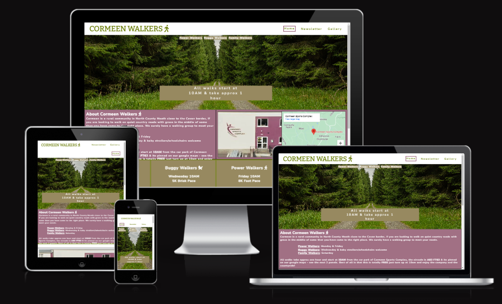

# Cormeen Walkers
SOB This is a WIP of my README, Anything preceeded by SOB is a placeholder for future edits

SOB 👩🏻‍💻 View an example of this section [here](https://github.com/kera-cudmore/Bully-Book-Club#bully-book-club-website)

This website is a landing page for anyone living around Cormeen that want to know when the Cormeen Walkers meet, they can view the gallery to see photos of the various groups and they can signup for the quarterly newsletter by providing their first name and a valid email address.

I wrote this website as I was continually contacted for information about the walking groups when and where etc & now I can simply send them a link which should give them most of the information they are looking for.  specifically do not want to include my contact phone number as I am trying to avoid receiving calls.(Add a Blurb about the site here, what does it do, why did you build it?)

SOBAdd an image of the finished site here - use [amiresponsive](https://ui.dev/amiresponsive) 

The GitHub link to the live site is https://siobhain.github.io/cormeen-walkers/

SOB?? If you want to add optional [shields.io](https://shields.io) badges to your README, I like to add them to this section.

---

## CONTENTS

* [User Experience](#user-experience-ux)
  * [User Stories](#user-stories)

* [Design](#design)
  * [Colour Scheme](#colour-scheme)
  * [Typography](#typography)
  * [Imagery](#imagery)
  * [Wireframes](#wireframes)

* [Features](#features)
  * [General Features on Each Page](#general-features-on-each-page)
  * [Future Implementations](#future-implementations)
  * [Accessibility](#accessibility)

* [Technologies Used](#technologies-used)
  * [Languages Used](#languages-used)
  * [Frameworks, Libraries & Programs Used](#frameworks-libraries--programs-used)

* [Deployment & Local Development](#deployment--local-development)
  * [Deployment](#deployment)
  * [Local Development](#local-development)
    * [How to Fork](#how-to-fork)
    * [How to Clone](#how-to-clone)

* [Testing](#testing)

* [Credits](#credits)
  * [Code Used](#code-used)
  * [Content](#content)
  * [Media](#media)
  * [Acknowledgments](#acknowledgments)

---

## User Experience (UX)

👩🏻‍💻 View an example of a completed user experience section [here](https://github.com/kera-cudmore/Bully-Book-Club#user-experience-ux)

### User Stories

#### Client Goals

- To minimise amount of time explaining when/where the walking groups meet, the pace, the routes taken & distance covered.
- Site to be responsive -  viewable on all device sizes & all commonly used  browsers
- Users can receive a newsletter by providing a name & email address
- Users can easily find eircode 
- Purposely not including contact phone number on this website as main goal is to reduce phone calls)
- Users can view gallery with photos of whats to be seen on the walks.

- Purposely not including contact phone number on this website as main goal is to reduce phone calls)

#### Key information

##### Guidelines
- No dogs
- High Visibility Jacket
- Weather appropriate Clothing & footwear

First time user
- Looking for general information about the group
- Looking for meet up times & locatipn

Users may arrive at this page via web search or direct link
-landing page - 
Most people want to know when group they are interested in are meeting, Some people are involved in more than one group

Returning Visitors
 - looking for day and time of a particular walking group
 - looking for eircode
 - interested in singing up for newsletter
EIRCODE EIRCODE EIRCODE forgot about it had to redo About CSC section aaaargh
had to add whole pile about eircodes directions etc and change footer
 
Add your user stories here. You want to include first time visitors and returning visitors here as a minimum. Think about each group, and the experience and journey you want them to have on your site. It really helps to think about this before you start coding, and will really help with creating your wireframes.

## Design

👩🏻‍💻 View an example of a completed design section [here](https://github.com/kera-cudmore/earth-day-hackathon-2022#Design)

### Colour Scheme

Add all information about your colour scheme for your site here. You can explain why you choose the colours you did?

I like to include a palette of the colour scheme here, my favourite site for creating a colour palette is [coolors](https://coolors.co/), but there are lots of other sites that also do the same thing, like [ColorSpace](https://mycolor.space/?hex=%23F5F5F5&sub=1), [Muzli Colors](https://colors.muz.li/), [Adobe Colour Wheel](https://color.adobe.com/create/color-wheel) and [Canva](https://www.canva.com/colors/color-palette-generator/) to name a few.

### Typography

If you've imported fonts to use in your project, add some information about them here. You can include information like:

Why did you choose the font you have?
Is this an accessibly friendly font?
What weights have you included?

I also like to include an image of the fonts chosen as a reference.

[Google Fonts](https://fonts.google.com/) is a popular choice for importing fonts to use in your project, as it doesn't require you to download the fonts to use them.

https://connectivewebdesign.com/blog/best-google-font-combinations

The fonts used for this website are Bitter & Nunito, Bitter is a serif type font & used for logo "Cormeen Walkers" in the header. Nunito is a san serif type font and used for all other text. Both fonts are imported from [Google Fonts](https://fonts.google.com/).  

With these font choices I have made the conscious decision to mix a serif with a san serif. The serif Bitter is used only in the header of the web page & although it is a traditional style it has a modern twist. The font is specifically designed for comfortably reading on any computer or device and is refeered to as a 'contemporary' serif typeface for text.  I did want to use a traditional type font for the logo but not one designed over 100 years ago and so Bitter became my choice. For the main text I wanted a clean looking text without extras so as not to distract from the information presented, but one that also blended well with the Bitter logo. Hence I chose Nunito which is a well balanced san serif type font & I think they work well together in this case.
### Imagery

Use this section to explain what sort of imagery you plan to use through your site.

### Wireframes

The site consistes of 3 pages Home, Gallery & Signup. Each page can be reached from the menu in the header.  The currect active page is highlighted with a box border*** clearly visible to the user.

The home page has the most important information such as the "When and Where" of the walking groups.   location and  meet up times 

For consistency of user experience the header and footer is same on each of the 3 pages.

The header contains the logo & navigation links to get around the website.
The footer contains the tag line "All walks start at 10am from Cormeen Sports Complex" *** along with social media links the home page of facebook, twitter & instagram.  As the site is for educational purposes only there are no social media accounts to link to. This informaiton is also outlined in the footer.

The Gallery page reinforces the sense of countryside, farmland & fresh air by displaying images of sights to be seen while on one of these walks. 

				Cormeen Walkers take a quarterly excursion to nearby Loughanlae where its alleged you can see 22 counties of Ireland on a good day! We announce details of upcoming trip in our quarterly newsletter along with photos and gossip from our most recent outing. 
				 Enter your details below to receive our Quarterly Newsletter (also gets rid of this fo
The Signup page outlines details of the quarterly daytrip and invites the user to submit their name and email address (verified) so that they can be send details of upcoming trip etc in a newsletter.  Once they hit "Send me Newsletter" button, the user will get a confirmation notice advising them to check their inbox for the newsletter and how to unsubscribe from receiving it. The confirmation notice is held on a seperate html pag called confirm but this is oblivious to the user as same backdrop is used for both pages. 

** RESPONSIVE
This ws is responsive, it maintains its layout when viewed on difference screen widths.  The site elements rearrange themesevles according to the current browser screeen width in order to maintain consistency of design and presentation.

## Features

👩🏻‍💻 View an example of a completed user experience section [here](https://github.com/kera-cudmore/TheQuizArms#Features)

Header & Footer common to all 3 pages

- Home Page : Hero Image, About, Groups, Information & Benefits
- Signup Page : firstname, email form & submit button
- Gallery Page : 12 framed photos in masonary style

### General features on each page

If there is a feature that appears on all pages of your site, include it here. Examples of what to include would the the navigation, a footer a nd a favicon.

I then like to add a screenshot of each page of the site here, i use [amiresponsive](https://ui.dev/amiresponsive) which allows me to grab an image of the site as it would be displayed on mobile, tablet and desktop, this helps to show the responsiveness of the site.

### Times
- There are 3 groups & 4 meetups per week

- Walkers : Meet twice a week Mon & Fri, 8k circuit
- Buggys : Meet Wed 10am 5K route
- Family : Meet Sat 10am 4k route

### Guidelines
- No dogs
- High Visibility Jacket
- Weather appropriate Clothing & footwear
- map to find us
Cormeen Sports Complex eircode a82 ft62 is in North County Meath close to the Cavan border, It is equidistant to the towns
				of Kells, Kingscourt & Bailieborough. It is a rural location with views of windmills on rolling farmland
				hills, walking routea from here will have you crossing old stone bridges and walking past farmland
				through the seasons, roads so quite that some have the grassy center!
### Future Implementations

Future 

The current newsletter and archives of past newsletter be made available to user
A "Route" section with drawing on google maps screenchots of routes travelled by the walking groups.  There are 8 different looped routes that can be taken form this crossroads location and each has its own uniqueness.  There are also 4 crosscountry/farmland routes to local townland/villages which were used by our ancestors in olden days where right of way is still upheld & thes eroutes could also be documented on the website.
Links on the web site to join the various Whatsapp groups maintained by Walk Leaders.

### Accessibility

Be an amazing developer and get used to thinking about accessibility in all of your projects!

This is the place to make a note of anything you have done with accessibility in mind. Some examples include:

Have you used icons and added aria-labels to enable screen readers to understand these?
Have you ensured your site meets the minimum contrast requirements?
Have you chosen fonts that are dyslexia/accessible friendly?

Code Institute have an amazing channel for all things accessibility (a11y-accessibility) I would highly recommend joining this channel as it contains a wealth of information about accessibility and what we can do as developers to be more inclusive.

## Technologies Used

👩🏻‍💻 View an example of a completed Technologies Used section [here](https://github.com/kera-cudmore/Bully-Book-Club#Technologies-Used)

### Languages Used

HTML & CSS.

### Frameworks, Libraries & Programs Used

Make sure to include things like 
git, GitHub,
wireframe handwritten the program used to make your wireframes, any programs used to compress your images, did you use a CSS framework like Bootstrap? If so add it here (add the version used).

A great tip for this section is to include them as you use them, that way you won't forget what you ended up using when you get to the end of your project.

## Deployment & Local Development

👩🏻‍💻 View an example of a completed Deployment & Local Development section [here](https://github.com/kera-cudmore/TheQuizArms#Deployment)

### Deployment

Include instructions here on how to deploy your project. For your first project you will most likely be using GitHub Pages.

### Local Development

The local development section gives instructions on how someone else could make a copy of your project to play with on their local machine. This section will get more complex in the later projects, and can be a great reference to yourself if you forget how to do this.

#### How to Fork

Place instructions on how to fork your project here.

#### How to Clone

Place instructions on how to clone your project here.

## Testing
SOB bug - family icon does not render
Start as you mean to go on - and get used to writing a TESTING.md file from the very first project!

Testing requirements aren't massive for your first project, however if you start using a TESTING.md file from your first project you will thank yourself later when completing your later projects, which will contain much more information.
  
Use this part of the README to link to your TESTING.md file - you can view the example TESTING.md file [here](milestone1-testing.md)

## Credits
SOB Irish Heart Foundation
👩🏻‍💻 View an example of a completed Credits section [here](https://github.com/kera-cudmore/BookWorm#Credits)

The Credits section is where you can credit all the people and sources you used throughout your project.

### Code Used

If you have used some code in your project that you didn't write, this is the place to make note of it. Credit the author of the code and if possible a link to where you found the code. You could also add in a brief description of what the code does, or what you are using it for here.

### Content

Who wrote the content for the website? Was it yourself - or have you made the site for someone and they specified what the site was to say? This is the best place to put this information.

###  Media

If you have used any media on your site (images, audio, video etc) you can credit them here. I like to link back to the source where I found the media, and include where on the site the image is used.
  
###  Acknowledgments

If someone helped you out during your project, you can acknowledge them here! For example someone may have taken the time to help you on slack with a problem. Pop a little thank you here with a note of what they helped you with (I like to try and link back to their GitHub or Linked In account too). This is also a great place to thank your mentor and tutor support if you used them.